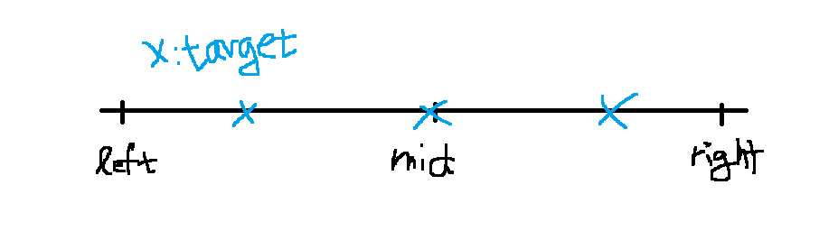

### lower bound와 upper bound

**정의**

- 정렬되어 있는 배열에서 **찾고자 하는 값이 여러개 있을 때** 사용
- lower bound : 배열에서 찾고자 하는 값들 중 **가장 작은 인덱스 찾기**
- upper bound : 배열에서 찾고자 하는 값들 중 **가장 큰 인덱스 찾기**

<br>

**원리**



- target : 찾고자 하는 값

- flat 하게 접근 필요

- lower bound

  - arr[mid] >= target인 경우
    - mid(현재 인덱스)가 정답 후보
    - mid가 가장 작은 인덱스인지 확인 필요
      - mid의 왼쪽 (left ~ mid-1) 구간에서 target값이 또 존재하는지 확인 필요

  - arr[mid] < target 인 경우
    - mid의 오른쪽 (mid+1 ~ right) 구간에서 target값 있는지 확인

- upper bound

  - arr[mid] <= target인 경우
    - mid(현재 인덱스)가 정답 후보
    - mid가 가장 큰 인덱스인지 확인 필요
      - mid의 오른쪽 (mid+1 ~ end) 구간에서 target값이 또 존재하는지 확인 필요

  - arr[mid] > target 인 경우
    - mid의 왼쪽 (left ~ mid-1) 구간에서 target값 있는지 확인

<br>

**구현 코드**

```java
import java.util.Arrays;

public class Lower_Upper_bound {
	static int[] arr = { 2, 3, 4, 7, 2, 3, 1, 1, 4, 7, 7, 6 };

	public static void main(String[] args) {
		Arrays.sort(arr);// 반드시 정렬
		System.out.println(Arrays.toString(arr));
		
		// 배열에 존재하는 값이 아닌 경우는 사용하지 않는다
		System.out.println(lower_bound(2));
		System.out.println(upper_bound(2));
		
	}

	private static int lower_bound(int target) {
		int left = 0;
		int right = arr.length - 1;
		int idx = N-1;

		while (left <= right) {
			int mid = (left + right) / 2;

			if (arr[mid] < target) {
				left = mid + 1;
			} else {
				right = mid - 1;
				idx = mid;
			}
		}

		return idx;
	}

	private static int upper_bound(int target) {
		int left = 0;
		int right = arr.length - 1;
		int idx = 0;
		
		while (left <= right) {
			int mid = (left + right) / 2;

			if (arr[mid] > target) {
				right = mid - 1;
			} else {
				left = mid + 1;
				idx = mid;
			}
		}
		
		return idx;
	}
}

```

