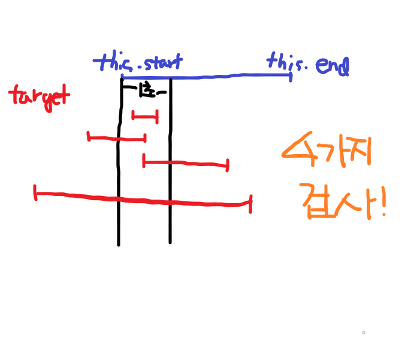

### [2018 카카오 공채 - 추석 트래픽](https://programmers.co.kr/learn/courses/30/lessons/17676)

**분류 : Simulation**


**접근방법**

- 트래픽의 응답시작시간과 응답완료시간 구하기

  - hh:mm:ss.sss 로 이뤄진 시각을 편리한 단위로 변경
    - split함수 활용
    - 0.001초를 1로 기준으로 하여 int로 변경
    - ex) 11초 -> 11 x 1000 --> 11000
  - list에 [응답시작시간, 응답완료시간] 추가

- 초당 최대 처리량 구하기

  - 원리

    - 완전탐색

    - 트래픽은 start(응답시작시간)와 end(응답완료시간)으로 이뤄진다

    - 다음 4가지로 구간을 나눠서 접근,  각 구간에 다른 트래픽이 몇 개 있는가 파악

      - (start - 0.999초, start)

      - (start. start + 0.999초)

      - (end - 0.999초, end)

      - (end, end + 0.999초)

        --> 위를 (this.start, this.end) 라고 두자

      - 또한 위의 4가지 구간에 대해 다른 트래픽이 속하는 경우는 다음과 같다

        - target.start(다른 트래픽의 응답시작시간), target.end(다른 트래픽의 응답완료시간)
        - this.start와 this.end (길이 : 1초)에 대하여 다음 4가지를 검사
          - this.start <= target.start 이고 target.end<= this.end 인 경우
          - this.start <= target.end 이고 this.end >= target.end 인 경우
          - this.end>= target.start 이고 this.end <= target.start 인 경우
          - this.start >= target.start 이고 this.end <= target.end인 경우

        - 예시

          <div>
              
          </div>

          

  **코드**

  ```java
  import java.util.*;
  
  /**
   * Simulation
   * 
   * @author beaverbae
   *
   */
  
  public class Solution {
  	private int answer = 0;
  	private List<Time> trafficList = new ArrayList<>();
  	private final int SECOND = 1000;
  
  	public int solution(String[] lines) {
  		for (String line : lines) {
  			String[] split_blank = line.split(" ");
  
  			String[] split_colon = split_blank[1].split("[:]");
  			String[] split_doc = split_colon[2].split("[.]");
  
  			String shr = split_colon[0];// 시
  			String sm = split_colon[1];// 분
  			String ss = split_doc[0];// 초
  			String sms = split_doc[1];// 밀리초
  
  			String sprocessTime = split_blank[2].substring(0, split_blank[2].length() - 1);
  			String[] split_sprocessTime = sprocessTime.split("[.]");
  
  			int front = Integer.parseInt(split_sprocessTime[0]) * 1000;
  			int end = 0;
  
  			if (split_sprocessTime.length > 1) {
  				end = Integer.parseInt(split_sprocessTime[1]);
  			}
  
  			int processTime = front + end;
  
  			int endTrafficTime = stoi(shr, sm, ss, sms);// 응답 완료 시간
  			int startTrafficTime = endTrafficTime - processTime + 1;// 응답 시작 시작
  
  			trafficList.add(new Time(startTrafficTime, endTrafficTime));
  		}
  
  		getMax();
  		return answer;
  	}
  
  	public void getMax() {
  		for (int i = 0; i < trafficList.size(); i++) {
  			Time traffic = trafficList.get(i);
  			
  			// 다음은 가능한 모든 경우의 수 이다
  			int processStartTime1 = traffic.start - SECOND + 1;
  			int processEndTime1 = traffic.start;
  			int processStartTime2 = traffic.start;
  			int processEndTime2 = traffic.start + SECOND - 1;
  			int processStartTime3 = traffic.end - SECOND + 1;
  			int processEndTime3 = traffic.end;
  			int processStartTime4 = traffic.end;
  			int processEndTime4 = traffic.end + SECOND - 1;
  
  			List<Integer> processTimeList = new ArrayList<>();
  			processTimeList.add(processStartTime1);
  			processTimeList.add(processEndTime1);
  			processTimeList.add(processStartTime2);
  			processTimeList.add(processEndTime2);
  			processTimeList.add(processStartTime3);
  			processTimeList.add(processEndTime3);
  			processTimeList.add(processStartTime4);
  			processTimeList.add(processEndTime4);
  
  			for (int j = 0; j < processTimeList.size() / 2; j++) {
  				int processStartTime = processTimeList.get(2 * j);
  				int processEndTime = processTimeList.get(2 * j + 1);
  
  				int cnt = 1;
  				for (int k = 0; k < trafficList.size(); k++) {
  					if (i == k)
  						continue;
  
  					Time target = trafficList.get(k);
  
  					if (target.start >= processStartTime && target.end <= processEndTime) {
  						cnt++;
  					} else if (target.end >= processStartTime && target.end <= processEndTime) {
  						cnt++;
  					} else if (target.start >= processStartTime && target.start <= processEndTime) {
  						cnt++;
  					} else if (target.start <= processStartTime && target.end >= processEndTime) {
  						cnt++;
  					}
  				}
  				answer = Math.max(answer, cnt);
  			}
  		}
  	}
  	
      // String to Integer
  	public int stoi(String shr, String sm, String ss, String sms) {
  		int hr = 60 * 60 * 1000 * Integer.parseInt(shr);
  		int m = 60 * 1000 * Integer.parseInt(sm);
  		int s = 1000 * Integer.parseInt(ss);
  		int ms = Integer.parseInt(sms);
  
  		return hr + m + s + ms;
  	}
  
  	static class Time {
  		int start, end;
  
  		public Time(int start, int end) {
  			this.start = start;
  			this.end = end;
  		}
  
  		@Override
  		public String toString() {
  			return "Time [start=" + start + ", end=" + end + "]";
  		}
  	}
  }
  ```

  